# Orbital Forge

> Idle / incrémental spatial pour Android — minez, raffinez, forgez l’univers.

Tapez un astéroïde, construisez des foreuses puis toute une chaîne industrielle
(**minerai → métal → alliages → composants → énergie → cristaux → matière noire**), colonisez
8 planètes, lancez des recherches en temps réel, envoyez des expéditions, et faites exploser votre
étoile en **Supernova** avant de vous effondrer dans un **Trou noir**.

100 % hors ligne · aucun backend · sons et graphismes 100 % procéduraux · français / anglais.

| Mine | Usine | Planètes | Recherche |
| --- | --- | --- | --- |
| 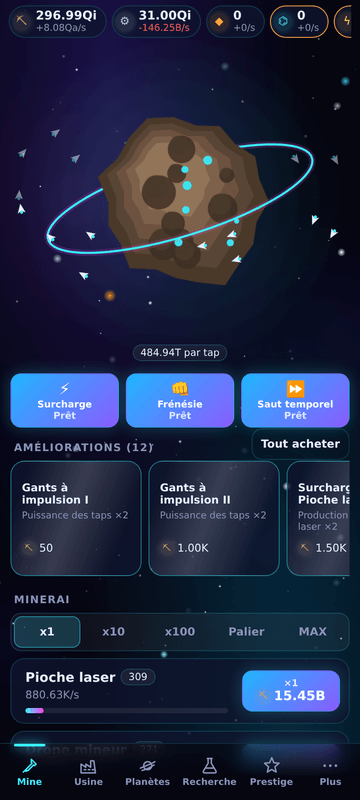 | 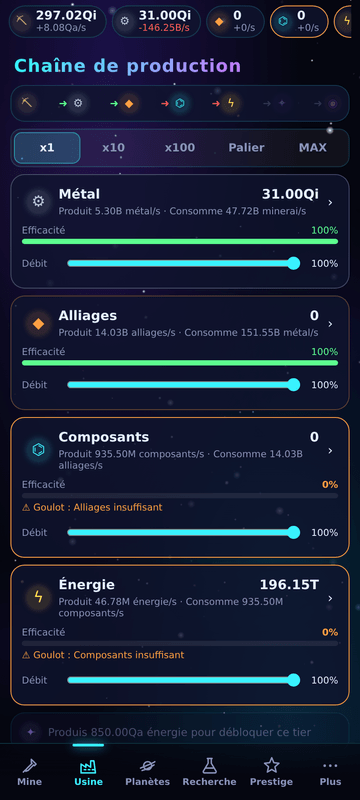 | 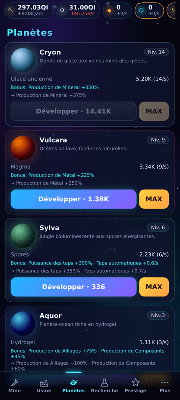 | 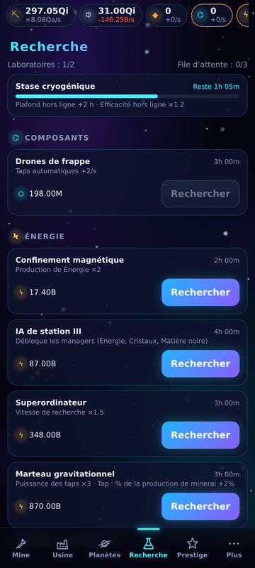 |

| Prestige | Missions | Succès | Statistiques |
| --- | --- | --- | --- |
| 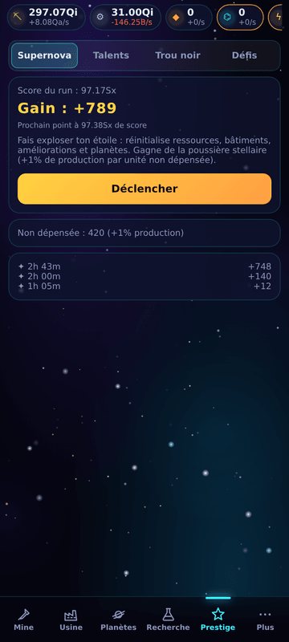 | 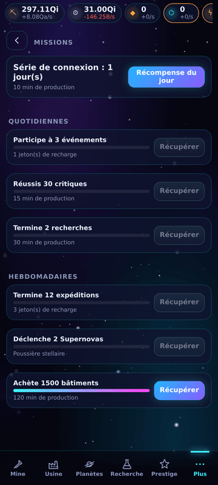 | 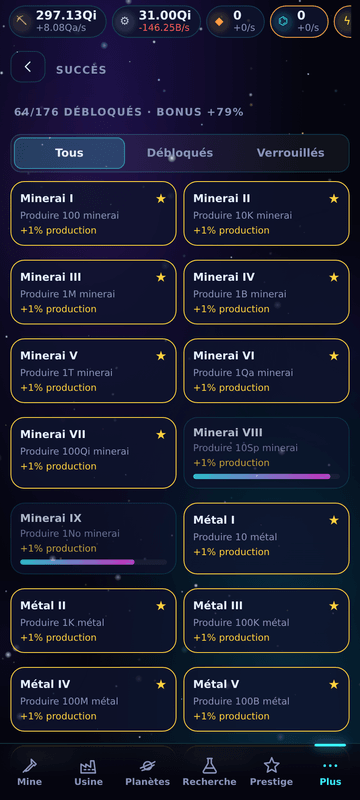 | 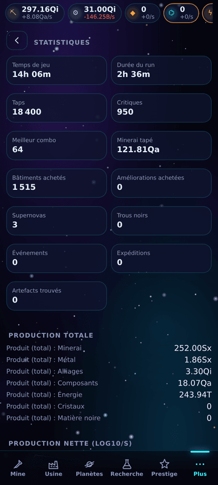 |

**Thème Material You** en option (Réglages → Thème) : palette tonale M3 générée depuis la couleur
d’accent dynamique d’Android 12+ ou une couleur au choix.

| Material You | Réglages |
| --- | --- |
| 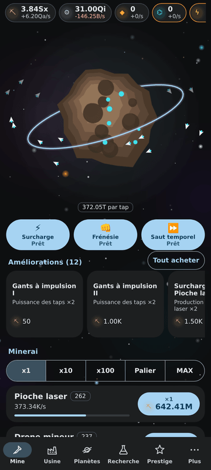 | 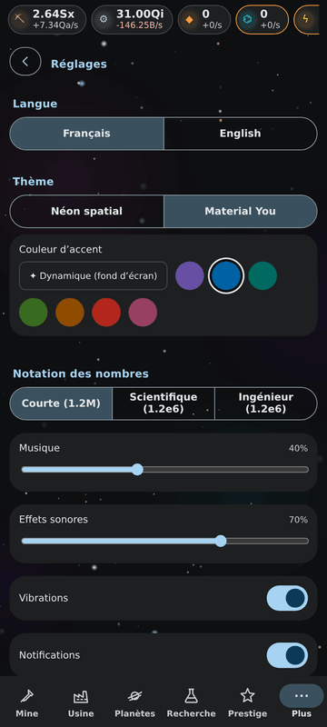 |

## Contenu

- **Boucle de tap** : critiques (×10), combos, particules, haptique et chiffres flottants.
- **Chaîne de 7 ressources** : de vrais convertisseurs qui consomment le tier précédent. Les goulots
  d’étranglement sont visibles et le débit de chaque tier se règle.
- **105 bâtiments** (15 par tier) à coût exponentiel. Achat ×1 / ×10 / ×100 / palier / max. Chaque
  palier (25, 50, 100, 200…) double la vitesse.
- **289 améliorations**, **40 recherches** temporisées avec file d’attente, **8 planètes**
  (ressource unique, biome, bonus).
- **Supernova** → poussière stellaire et **50 talents** en 5 branches.
- **Trou noir** → singularités, 16 méta-améliorations et nouvelles mécaniques (Supernova automatique,
  flux sombre, écho, défis II…).
- **8 défis**, **30 artefacts** en 4 raretés, **expéditions**, missions quotidiennes et hebdomadaires,
  série de connexion, **176 succès**.
- **Événements aléatoires** (pluie de météores, comète dorée, marchand galactique, tempête solaire) et
  **boosts** (surcharge ×2, frénésie, saut temporel).
- **IA de station** : managers configurables (moins cher / rentabilité / ciblé, réserve) et
  améliorations automatiques.
- **Gains hors ligne** : simulation réelle de toute la chaîne, plafond de 8 h extensible, écran de
  retour animé, notifications locales.
- **Thèmes** : néon spatial (défaut) ou Material You (couleur dynamique Android 12+).
- **Accessibilité** : mode OLED, taille du texte, réduction des animations, qualité basse, notation
  courte, scientifique ou ingénieur.

## Stack

Vite · React 18 · TypeScript strict · Zustand + Immer · PixiJS 8 · break_infinity.js · Howler.js +
Web Audio · Framer Motion · Capacitor 8 (Android) · Vitest · ESLint + Prettier.

Architecture détaillée et conventions : voir [CLAUDE.md](CLAUDE.md).

## Lancement local

```bash
npm ci
npm run dev          # http://localhost:5173
npm test             # tests Vitest (formules, chaîne, hors ligne, sauvegardes, systèmes)
npm run lint && npm run typecheck
```

Menu debug : dans **Plus → Réglages**, tapez 7 fois sur le numéro de version.

## Équilibrage

```bash
npm run simulate -- --hours 72          # courbe CSV/SVG + rapport dans sim-output/
```

Le bot joue seul : achats selon le temps de retour sur investissement, recherches, planètes,
expéditions, prestiges, et nuits de 8 h simulées hors ligne. Résultats actuels
([rapport](docs/balance/report.json)) :

| Cible | Simulé |
| --- | --- |
| 1er Supernova ≈ 1 h | **1,1 h** |
| 1er Trou noir ≈ 2–3 jours | **51 h** |
| Jamais plus de 10 min sans achat en début de run | **6,6 min max** |

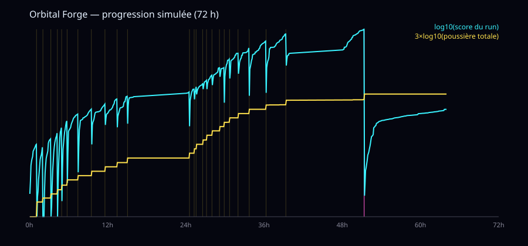

## Build Android

Prérequis : **JDK 21** (requis par Capacitor 8) et Android SDK (API 36).

```bash
npm run build
npx cap sync android
cd android && ./gradlew assembleDebug        # APK debug
```

- Icônes et splash : les sources SVG sont dans `assets/`. `npm run assets` les convertit en PNG puis
  lance `@capacitor/assets` (icône adaptative + splash clair/sombre).
- `versionName` et `versionCode` sont dérivés du tag git `vX.Y.Z` : `X.Y.Z` et
  `X×1 000 000 + Y×1 000 + Z`.
- Signature locale : créez `android/keystore.properties` (ignoré par git) :

```properties
storeFile=/chemin/vers/orbital-forge.jks
storePassword=...
keyAlias=orbitalforge
keyPassword=...
```

## Release (GitHub Actions)

- `ci.yml` : lint, format, tests et build à chaque push et PR.
- `release.yml` : se déclenche sur un tag `v*.*.*` ou manuellement. Il enchaîne tests, build Vite,
  `cap sync`, JDK 21, cache Gradle, **APK + AAB signés**, puis crée une **GitHub Release** avec le
  changelog généré depuis les commits.

### 1. Générer le keystore (une seule fois)

```bash
keytool -genkeypair -v \
  -keystore orbital-forge.jks \
  -alias orbitalforge \
  -keyalg RSA -keysize 4096 -validity 10000 \
  -dname "CN=Karelisio, O=Orbital Forge, C=FR"
```

Conservez ce fichier et ses mots de passe hors du dépôt : sans eux, impossible de publier une mise à
jour sur le Play Store.

### 2. Encoder en base64

```bash
base64 -w 0 orbital-forge.jks > keystore.b64      # Linux
base64 -i orbital-forge.jks | tr -d '\n' > keystore.b64   # macOS
```

### 3. Secrets GitHub (Settings → Secrets and variables → Actions)

| Secret | Valeur |
| --- | --- |
| `ANDROID_KEYSTORE_BASE64` | contenu de `keystore.b64` |
| `ANDROID_KEYSTORE_PASSWORD` | mot de passe du keystore |
| `ANDROID_KEY_ALIAS` | `orbitalforge` |
| `ANDROID_KEY_PASSWORD` | mot de passe de la clé |

### 4. Publier

```bash
git tag v1.0.0 && git push --tags
```

## Sauvegardes

- Sauvegarde automatique toutes les 10 s et à la mise en arrière-plan.
- Double emplacement (principal + secours) avec somme de contrôle.
- Format versionné avec migrations.
- Export et import en texte (`OF1:…`, base64) ou en fichier via le partage Android.

## Licence et assets

Code original. L’icône, les sons et la musique sont générés par le code (SVG, synthèse Web Audio) :
aucun asset sous licence tierce.
